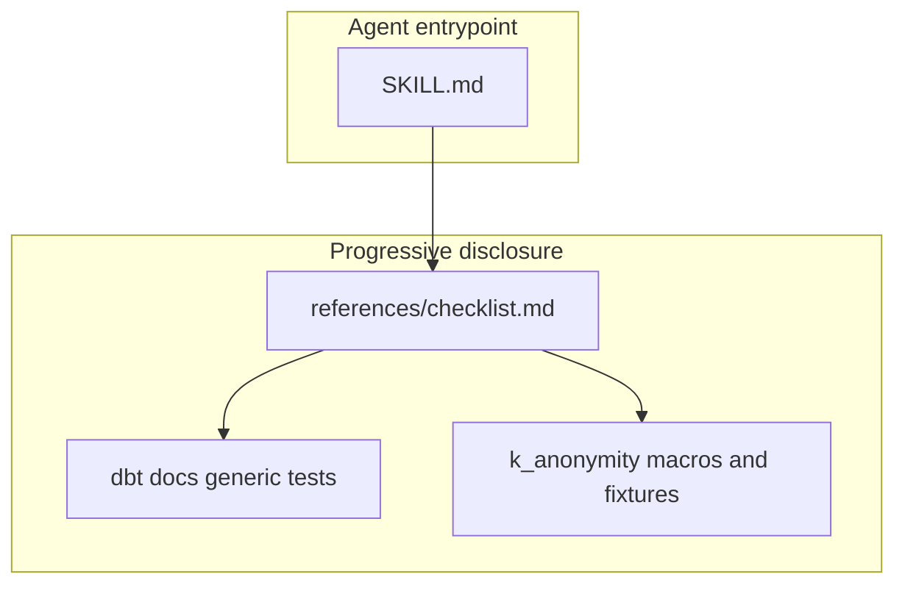
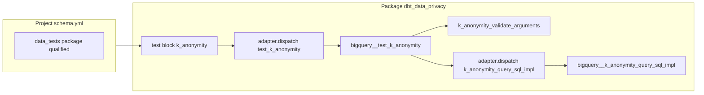
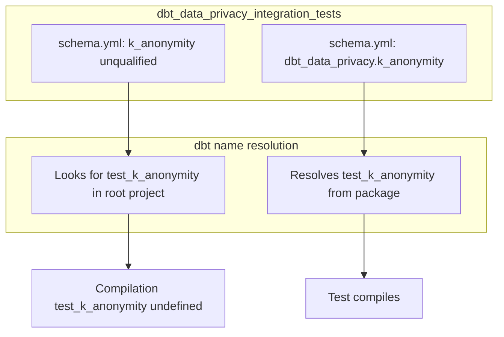

# Checklist: custom generic data test (dbt)

Use with the parent skill. Official baseline: [Writing custom generic data tests](https://docs.getdbt.com/best-practices/writing-custom-generic-tests?version=1.12).

**Reference implementation in this repo:** `macros/generic_tests/k_anonymity/` and `integration_tests/models/generic_tests/k_anonymity/`.

---

## Diagram: documentation layers



---

## Diagram: dispatch flow (package pattern)



---

## Diagram: child project must qualify package tests



---

## 1. dbt contract (generic test)

- [ ] Define a ` ... ` block (or place under `tests/generic/` per dbt docs).
- [ ] Accept standard arguments `model` and, when useful, `column_name` (even if unused) so the test can attach at model or column level.
- [ ] Return **SQL that selects failing rows**; zero rows ⇒ pass, any row ⇒ fail.
- [ ] For compile-time validation only, use `exceptions.raise_compiler_error`; use `` / `execute` guards so parsing does not hit the warehouse when appropriate.

---

## 2. Adapter dispatch (this package’s pattern)

- [ ] Thin `` body: `adapter.dispatch("test_<name>", "<package_name>")(...)` returning the dispatched macro result.
- [ ] Implement `bigquery__test_<name>(...)` when BigQuery is the only supported adapter (omit `default__` intentionally if that is the product decision).
- [ ] Qualify internal macros from the same package with `dbt_data_privacy.<macro>` when called from dispatched code so dependent projects resolve symbols correctly.
- [ ] Split optional logic into named macros (e.g. `<name>_validate_arguments`, query builder + `bigquery__<name>_query_sql_impl`); prefer **one file per macro name**, except macros sharing the same `adapter.dispatch` hook may live in one file named after that hook—follow existing `k_anonymity` layout.

### Example A — test block + dispatch + BigQuery implementation (pattern)

```jinja

  {{ return(adapter.dispatch("test_my_test", "dbt_data_privacy")(model, column_name, custom_arg)) }}



  {{- dbt_data_privacy.my_test_validate_arguments(custom_arg) -}}

  {{ return("") }}

  {{ return(adapter.dispatch("my_test_query_sql_impl", "dbt_data_privacy")(model, custom_arg)) }}

```

---

## 3. SQL builder for unit testing (optional but recommended)

- [ ] Expose a public macro (e.g. `<name>_test_query_sql(...)`) that validates arguments then `adapter.dispatch("<name>_query_sql_impl", ...)` so integration macro tests can assert on SQL text without relying only on the generic test runner.
- [ ] Keep macro property YAML safe: do not put raw Jinja open/close tags inside `description` strings (dbt renders those YAML files as Jinja).

---

## 4. Macro documentation (`macros/.../*.yml`)

- [ ] Under `macros:`, document the compiled generic test macro name as `test_<name>` (e.g. test block `k_anonymity` ⇒ `test_k_anonymity`), per dbt docs.
- [ ] Add `description` and `arguments` with `type` / `description` aligned with [macro properties](https://docs.getdbt.com/reference/macro-properties).

### Example C — macro property entry (minimal)

```yaml
version: 2
macros:
  - name: test_k_anonymity
    description: "..."
    arguments:
      - name: model
        type: relation
        description: "..."
```

Document only the public generic test in YAML unless you intentionally want other macros in docs.

---

## 5. Integration test project (`integration_tests`)

- [ ] Add a small fixture model (or seed) and attach the test in `schema.yml`.
- [ ] If the package is a **local** dependency and the root project is not the package: qualify the test as `dbt_data_privacy.<name>` in YAML so dbt resolves `test_<name>` from the package.
- [ ] If the project sets `require_generic_test_arguments_property: true`, nest custom args under `arguments:` in YAML.

### Example B — child project YAML

```yaml
models:
  - name: example_model
    data_tests:
      - dbt_data_privacy.k_anonymity:
          arguments:
            quasi_identifiers: [qi_a, qi_b]
            k: 5
            sample_limit: 10
```

---

## 6. Macro unit tests (naming)

- [ ] **Do not** define an integration macro named `test_<same_name>`—it shadows the package generic test.
- [ ] Use a distinct name (e.g. `test_<name>_sql_fragments`) and call the package SQL builder for assertions.

### Example D — distinct macro name + SQL builder

```jinja

  {{- return(adapter.dispatch("test_k_anonymity_sql_fragments", "dbt_data_privacy_integration_tests")()) -}}



  
  

```

---

## 7. README and verification

- [ ] Document semantics (pass/fail), adapter support, YAML example with package qualification when relevant (`README.md` or `docs/`).
- [ ] Run `make run-unit-tests` from repo root; run `make run-integration-tests` when behavior touches compiled SQL or BigQuery flows (`AGENTS.md`).

---

## 8. Common pitfalls

| Issue | Mitigation |
|--------|------------|
| `test_<name>` is undefined in child project | Use `dbt_data_privacy.<name>` under `data_tests` in YAML. |
| Generic test never runs / wrong macro | `` registers `test_x`; YAML key is `x` (or `package.x`). |
| Jinja errors in macro property YAML | Avoid Jinja tag syntax inside `description` strings. |
| nox: `--no-color` and `--force-color` | [`integration_tests/Makefile`](../../../../integration_tests/Makefile) runs nox with `env -u NO_COLOR`. |
