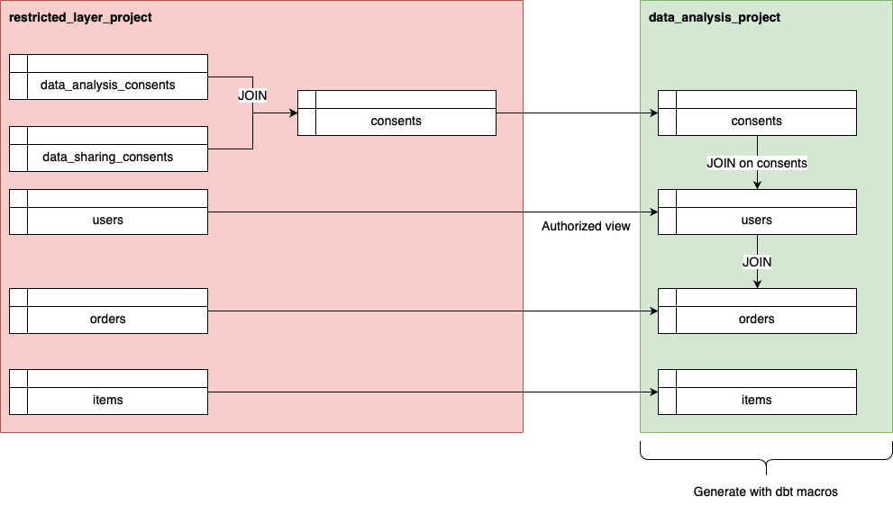

# Generate privacy-protected dbt models

The documentation explains how to automatically apply data handling rules on data warehouses using dbt, as well as how to construct privacy-protected dbt models through data classification and data inventory.

## Overview

Since dbt can describe both table- and column-level metadata, dbt-data-privacy enables us to create dbt models to ensure privacy based on metadata.
Based on the specified metadata, the dbt Package builds dbt models.
To accomplish that, we use one of the common procedures of data assessment with data classification, data inventory, and data handling standards.

### Terminology

We would like to define some words to make the subsequent explanations clearer in the documentation.

- **data classification** is the process of separating an organization’s information into defined categories.
- **data inventory** tags and compiles this data, including their relationships and movements, into a single source of truth.
- **data handling standards** provide guidance on how to manage each data classification type within specific activities or scenarios.
- **privacy-protected models** are dbt models automatically generated by the `dbt-data-privacy` dbt Package.

## How to generate privacy-protected models

I would like to walk through examples of the integration tests of the package in [`integration_tests`](../integration_tests) so that we understand the code generation feature of privacy-protected dbt models with dbt-data-privacy.
Now we assume we build a data warehouse for a virtual e-commerce service on BigQuery and manage customers' consents on data analysis and data sharing respectively.
We want to make only data with consents on data analysis available and don't want to make data without consents on that available.
To achieve that, we have the two Google Cloud projects.
One is used to load raw data from the source databases like MySQL.
Data consumers like data analysts aren't allowed to access it.
The other is used to build a privacy-aware data warehouse for data analysis.
Data consumers can access the warehouse.



Here, let's consider we have the subsequent five tables in the virtual service.
We would like to filter out data without consents on data analysis in the `data_analysis_project`.

- `users` table manages customers' profiles.
- `items` table manages items in the virtual e-commerce service.
- `orders` table manages transactions that customers purchase items.
- `data_analysis_consents` table manages customers' agreement on data analysis.
- `data_sharing_consents` table manages customers' agreement on data sharing to 3rd party. (We don't use it in the example at all.)

First, we would like to create a dbt model to aggregate information about customers' consents in a single place.
The created table is [the `consent` table](https://github.com/ubie-oss/dbt-data-privacy/blob/main/integration_tests/models/restricted_layer/dbt_data_privacy_restricted_layer/consents/restricted_layer__dbt_data_privacy_restricted_layer__consents.sql).
This is for a realistic situation to manage consents, because some organizations don't consistently manage customers' agreements to data objectives.
The data aren't managed in a single place.
So, data consumers may want to manage them together as a single source of truth to analyze data.
So, it would be good to aggregate them on the warehouse so that we respect customers' compliance.

Second, we would like to exclude data without consents on data analysis in `users` and `orders` using the `consents` table we create.
That is, only data in `users` and `orders` gets available by joining with the `consents` table, if the customers' compliance is ok.
We are going to learn how to generate privacy-protected dbt models for `consents`, `users`, and `orders` in the subsequent subsections.
To accomplish that, we have three steps.

1. Define data classification and data handling standards
2. Implement table-level and column-level metadata in dbt schema YAML files to generate privacy-protected models
3. Generate dbt models

### 1. Define data classification and data handling standards

In this section, we would like to explain the way to configure dbt-data-privacy.
The dbt Package enables us to set configurations to securely handle data as `data_handling_standards`.

The subsequent code block shows an example of a dbt variable to configure dbt-data-privacy.
We are able to define multiple configurations for desired objectives since we may want to apply different data handling standards in different situations.
The two sets of configurations are designated as `data analysis` and `application` in the following example.
For example, if we have to pseudonymize customers' data in regulatory for data analysis so that persons as data analysts can access it, we want to pseudonymize unique identifiers like customer IDs.
On the other hand, if we have other dbt models which are only used by applications, not persons, we don't have to pseudonymize them.

This is an example of a YAML file of dbt variables is [../integration_tests/resources/vars/vars-bigquery.basic.yml](https://github.com/ubie-oss/dbt-data-privacy/blob/401a895651d798ba2aea5a382ed0d651a175bf0e/integration_tests/resources/vars/vars-bigquery.basic.yml#L5-L24).
If you want to embed the variables in your `dbt_project.yml`, that would be ok too.

```yaml
data_privacy:
  data_analysis:  # A custom data objective liked to metadata to generate privacy-protected models
    default_materialization: view  # default materialization of generate privacy-protected models
    data_handling_standards:
      public:
        method: RAW
      internal:
        method: RAW
      confidential:
        converted_level: internal
        method: SHA256
      restricted:
        method: DROPPED
  application:  # A custom data objective liked to metadata to generate privacy-protected models
    default_materialization: view  # default materialization of generate privacy-protected models
    data_handling_standards:
      public:
        method: RAW
      internal:
        method: RAW
      confidential:
        method: RAW
      restricted:
        method: DROPPED
```

### `default_materialization`

`default_materialization` allows us to set the default materialization of dbt models generated by dbt-data-privacy.
If it is set to `view`, the materialization of dbt models will be `view`.
If it is set to `table`, the materialization will be `table`.

### `data_handling_standards`

We can define a mapping between column-level data classification levels and methods using `data_handling_standards`.
The example defines four data classification levels: `public`, `internal`, `confidential`, and `restricted`.
However, we can freely define any data classification levels according to our definitions.

```yaml
data_privacy:
  data_analysis:
    data_handling_standards:
      public:
        method: RAW
      internal:
        method: RAW
      confidential:
        converted_level: internal
        method: SHA256
      restricted:
        method: DROPPED
```

#### Supported methods in `data_handling_standards`

At the time of writing this documentation, we only support BigQuery.
If dbt-data-privacy supports other data warehouses in the future, we may implement methods specialized for those data warehouses.

##### `RAW`

This method doesn't transform the given original column.
If a column is tagged as `public` under the data handling standards, the values remain raw.

```yaml
data_privacy:
  DATA_OBJECTIVE:
    data_handling_standards:
      public:
        method: RAW
```

##### `SHA256`

The method applies a SHA-256 function to a column which is categorized as `confidential`.
If the data classification level `confidential` is tagged to a column, a SHA-256 function is applied to the column.

Additionally, we are able to define downgraded data classification levels in generated models with `converted_level`.

```yaml
data_privacy:
  DATA_OBJECTIVE:
    data_handling_standards:
      confidential:
        method: SHA256
        converted_level: internal
```

##### `SHA512`

The method applies a SHA-512 function to a column which is categorized as `confidential`.
If the data classification level `confidential` is tagged to a column, a SHA-512 function is applied to the column.

```yaml
data_privacy:
  DATA_OBJECTIVE:
    data_handling_standards:
      confidential:
        method: SHA512
        converted_level: internal
```

##### `DROPPED`

The methods drops columns with a specified data classification.

```yaml
data_privacy:
  DATA_OBJECTIVE:
    data_handling_standards:
      restricted:
        method: DROPPED
```

##### `CONDITIONAL_HASH`

For example, under the California Consumer Privacy Act (CCPA), if IP addresses aren't tied with any unique identifiers such as customer IDs, IP addresses aren't considered personal identifiable information (PII).
However, if IP addresses are tied with unique identifiers, they become PII.
The method enables us to deal with conditional pseudonymization.
We currently have only one condition: `contains_pseudonymized_unique_identifiers`.
If unique identifiers tied with something like an IP address are appropriately pseudonymized, such data can be made available with the condition.

```yaml
data_privacy:
  DATA_OBJECTIVE:
    data_handling_standards:
      restricted:
        method: CONDITIONAL_HASH
        converted_level: internal
        with:
          default_method: SHA256
          conditions: ["contains_pseudonymized_unique_identifiers"]
```
### 2. Implement table-level and column-level metadata in dbt schema YAML files to generate privacy-protected models

Now that we have learned how to configure dbt-data-privacy, let's move on to exercise data inventory to generate privacy-protected models with practical examples of `consents` and `users`.

#### `consents`

First, we annotate metadata to create a dbt model for `consents`, which we aggregate from `data_analysis_consents` and `data_sharing_consents`.
The code block below under `meta.data_privacy` contains information about a generated dbt model.
As the data type under `data_privacy` is an array, we can define multiple generated models.
In this case, we annotate the metadata to a dbt model.
However, we can also annotate the metadata to a dbt source.

- `name` is a model ID of a generated dbt model.
- `objective` corresponds to the data objective we configured in step 1. We can specify the data handling standards that the generated dbt models follow.
- `config` is passed to the `config` macro of a generated dbt model.
- `where` is a custom condition to filter data.
- `extra_meta` is extra metadata of a generated dbt model.

```yaml
# integration_tests/models/restricted_layer/dbt_data_privacy_restricted_layer/consents/schema.yml
    meta:
      data_privacy:
        - name: data_analysis_layer__dbt_data_privacy_data_analysis_layer__consents
          objective: data_analysis
          config:
            enabled: true
            materialized: view
            database: var('data_analysis_layer')
            schema: "dbt_data_privacy_data_analysis_layer"
            alias: "consents"
            grant_access_to:
              - project: var('restricted_layer')
                dataset: "dbt_data_privacy_restricted_layer"
            tags: []
            labels:
              modeled_by: dbt
          where: |
            consent.data_analysis IS TRUE
          extra_meta:
            database_alias: data_analysis_layer
```

Next, we would like to perform column-level data inventory in the schema YAML file as well.
The code block is a part of [`integration_tests/models/restricted_layer/dbt_data_privacy_restricted_layer/consents/schema.yml`](../integration_tests/models/restricted_layer/dbt_data_privacy_restricted_layer/consents/schema.yml).
We can annotate metadata for column-level data classification.
For example, the data classification level of the `user_id` column can be set to `confidential` so that the data is pseudonymized in the environment for data analysis.

- `level` specifies a column-level data classification level.
- `policy_tags` annotate policy tags of the column. If we use the `CONDITIONAL_HASH` method, columns with the corresponding data classification level and `unique_identifier` are pseudonymized.

Additionally, we can specify column-level generic tests with a corresponding dbt model.
In this case, we would like to test the uniqueness of the pseudonymized `user_id` under `data_analysis_layer__dbt_data_privacy_data_analysis_layer__consents`.
We need to change the key to your model ID.

```yaml
# integration_tests/models/restricted_layer/dbt_data_privacy_restricted_layer/consents/schema.yml
    columns:
      - name: user_id
        description: "User ID"
        meta:
          data_privacy:
            level: confidential
            policy_tags: ["unique_identifier"]
            data_analysis_layer__dbt_data_privacy_data_analysis_layer__consents:
              data_tests: ["unique"]
      - name: pseudonymized_user_id
        description: "Pseudonymized user ID"
        data_tests:
          - not_null
      - name: consent.data_analysis
        description: "Consent agree of data analysis"
        meta:
          data_privacy:
            level: internal
```

#### `users`

Second, we create a privacy-protected dbt model for the `users` table.
The basic idea is to filter out data of users who don't agree on data analysis by joining `users` with `consents`.

The structure of the metadata of `users` is almost the same as that of `consents`.
The difference is in `relationships` where we define the relationship with `consents`.
We are able to define multiple relationships in `relationships`.

- `to` manages a joined model.
- `fields` manages pairs of columns (or expressions) to join tables. The keys are columns of the base table. The values are columns of the target table. In this case, `users` is joined with `consents` on `users.user_id` and `consents.user_id`.
- `where` manages custom conditions to filter the target table. In this case, `consents` are selected by the condition before joining to `users`.

```yaml
    meta:
      data_privacy:
        - name: data_analysis_layer__dbt_data_privacy_data_analysis_layer__users
          objective: data_analysis
          config:
            enabled: true
            materialized: view
            database: var('data_analysis_layer')
            schema: "dbt_data_privacy_data_analysis_layer"
            alias: "users"
            grant_access_to:
              - project: var('restricted_layer')
                dataset: "dbt_data_privacy_restricted_layer"
            tags: []
            labels:
              modeled_by: dbt
          relationships:
            - to: ref("data_analysis_layer__dbt_data_privacy_data_analysis_layer__consents")
              fields:
                user_id: user_id
              where: |
                consent.data_analysis IS TRUE
          extra_meta:
            database_alias: data_analysis_layer
```

### Generate privacy-protected models

We have annotated table-level and column-level metadata to generate privacy-protected dbt models with a macro from the dbt-data-privacy package.
dbt offers a subcommand `dbt run-operation` which enables us to call a dbt macro.
We call the `generate_privacy_protected_models` macro to get a JSON object about generated dbt models.
The global option `--quiet` makes a dbt command suppress all non-error logging to stdout.
As we can get a JSON object returned by the macro without all non-error logging, we pass it to the following pipe in a shell command, for instance.

Unfortunately, dbt macros on top of jinja2 don't enable us to deal with file output.
So, the `generate_privacy_protected_models` macro returns a JSON object to generate dbt models.
Therefore, it would be good to implement a script like [`integration_tests/scripts/generate_secured_models.sh`](../integration_tests/scripts/generate_secured_models.sh) so that we can create files of privacy-protected dbt models.

```commandline
dbt --quiet run-operation dbt_data_privacy.generate_privacy_protected_models
```

[The pull request](https://github.com/ubie-oss/dbt-data-privacy/pull/49) demonstrates how to generate dbt models.
We examine the generated `consents` and `users` in the data analysis project.

#### `consents`

As a result of generating dbt models using the macro, [consents](https://github.com/ubie-oss/dbt-data-privacy/blob/489ee324f3e95c3cccdf7b69767ee5b306bc9647/integration_tests/models/data_analysis_layer/dbt_data_privacy_data_analysis_layer/consents/data_analysis_layer__dbt_data_privacy_data_analysis_layer__consents.sql) looks like the subsequent code block.
We see that the information about the `config` macro is passed as expected.
Additionally, the `SHA256` function is applied to the `user_id` column based on the data inventory for pseudonymization.

```sql
-- This was automatically generated by the `dbt-data-privacy` package.
{{
  config(
    materialized="view",
    database=var('data_analysis_layer'),
    schema="dbt_data_privacy_data_analysis_layer",
    alias="consents",
    grant_access_to=[
      {
        "project": var('restricted_layer'),
        "dataset": "dbt_data_privacy_restricted_layer",
      },
    ],
    tags=['data_analysis', 'dbt_data_privacy'],
    labels={
      "modeled_by": "dbt",
    },
    persist_docs={'relation': True, 'columns': True},
    full_refresh=None,
    enabled=True
  )
}}

WITH privacy_protected_model AS (
  SELECT
    SHA256(CAST(user_id AS STRING)) AS `user_id`,
    STRUCT(
      consent.data_analysis AS `data_analysis`,
      SHA256(CAST(consent.data_sharing AS STRING)) AS `data_sharing`
    ) AS `consent`,
    ARRAY(SELECT SHA256(CAST(e AS STRING)) FROM UNNEST(dummy_array) AS e) AS `dummy_array`,
  FROM
    {{ ref('restricted_layer__dbt_data_privacy_restricted_layer__consents') }} AS __original_table
  WHERE
    consent.data_analysis IS TRUE
)

SELECT
  __source.*,
FROM privacy_protected_model AS __source
```

#### `users`

In accordance with `consents`, [the generated `users`](https://github.com/ubie-oss/dbt-data-privacy/blob/489ee324f3e95c3cccdf7b69767ee5b306bc9647/integration_tests/models/data_analysis_layer/dbt_data_privacy_data_analysis_layer/users/data_analysis_layer__dbt_data_privacy_data_analysis_layer__users.sql) looks like the subsequent code block.
Since we define the relationships between `users` and `consents` in the table-level metadata, the two tables are joined by the specified conditions.
Additionally, the `SHA256` function is applied to the `user_id` and `age` columns based on the data inventory for pseudonymization.

```sql
-- This was automatically generated by the `dbt-data-privacy` package.
{{
  config(
    materialized="view",
    database=var('data_analysis_layer'),
    schema="dbt_data_privacy_data_analysis_layer",
    alias="users",
    grant_access_to=[
      {
        "project": var('restricted_layer'),
        "dataset": "dbt_data_privacy_restricted_layer",
      },
    ],
    tags=['data_analysis', 'dbt_data_privacy'],
    labels={
      "modeled_by": "dbt",
    },
    persist_docs={'relation': True, 'columns': True},
    full_refresh=None,
    enabled=True
  )
}}

WITH privacy_protected_model AS (
  SELECT
    id AS `id`,
    SHA256(CAST(user_id AS STRING)) AS `user_id`,
    SHA256(CAST(age AS STRING)) AS `age`,
  FROM
    {{ ref('restricted_layer__dbt_data_privacy_restricted_layer__users') }} AS __original_table
)
, __relationships_0 AS (
  SELECT *
  FROM {{ ref("data_analysis_layer__dbt_data_privacy_data_analysis_layer__consents") }} AS __relationships_0
  WHERE
    consent.data_analysis IS TRUE
)

SELECT
  __source.*,
FROM privacy_protected_model AS __source
JOIN __relationships_0
  ON __source.user_id = __relationships_0.user_id
```
